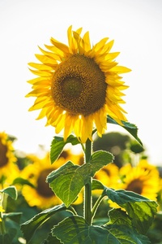
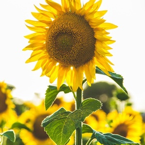
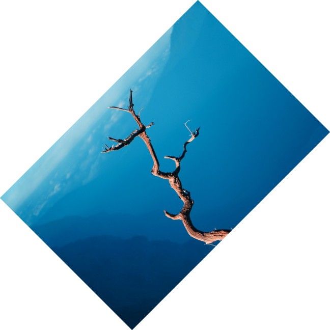
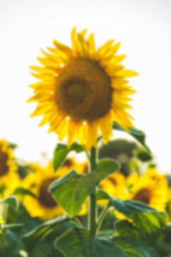
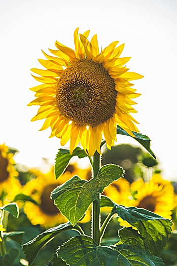
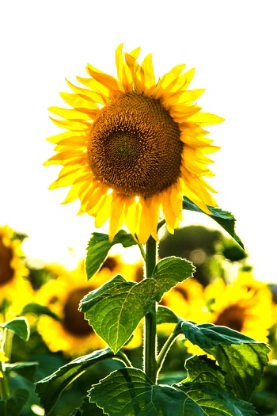
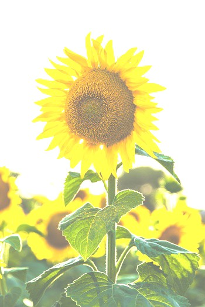
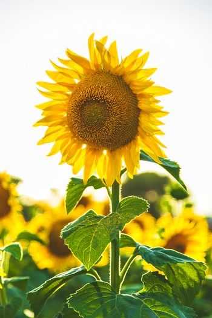
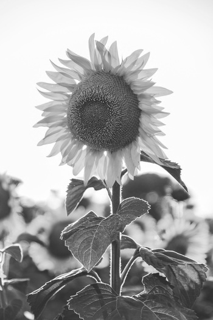
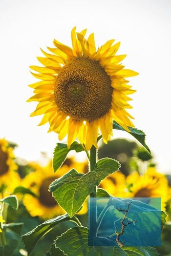

# imgx

[](https://pkg.go.dev/github.com/razzkumar/imgx)

Package imgx provides basic image processing functions (resize, rotate, crop, brightness/contrast adjustments, etc.).

All the image processing functions provided by the package accept any image type that implements `image.Image` interface
as an input, and return a new image of `*image.NRGBA` type (32bit RGBA colors, non-premultiplied alpha).

## Table of Contents

- [Installation](#installation)
  - [As a Library](#as-a-library)
  - [As a CLI Tool](#as-a-cli-tool)
- [Documentation](#documentation)
  - [CLI Documentation](./docs/CLI.md) - Complete CLI guide
  - [Version Management](./docs/VERSIONING.md) - How versions are managed
  - [Release Process](./docs/RELEASING.md) - How to create releases
- [Library Usage Examples](#library-usage-examples)
  - [Quick Start](#quick-start---using-as-a-library)
  - [Image Resizing](#image-resizing)
  - [Image Rotation](#image-rotation)
  - [Image Flipping](#image-flipping)
  - [Gaussian Blur](#gaussian-blur)
  - [Sharpening](#sharpening)
  - [Color Adjustments](#color-adjustments)
- [More Library Usage Examples](#more-library-usage-examples)
  - [Watermark Example](#example-3-add-watermark)
  - [Image Transformations](#example-4-image-transformations)
  - [Effects and Filters](#example-5-image-effects-and-filters)
- [Advanced Example: Image Collage](#advanced-example-image-collage)
- [Features](#features)
- [Performance](#performance)
- [FAQ](#faq)
- [Acknowledgments](#acknowledgments)
- [License](#license)

## Installation

### As a Library

```bash
go get -u github.com/razzkumar/imgx
```

### As a CLI Tool

```bash
# Build from source
go build -o imgx ./cmd/imgx

# Or install
go install github.com/razzkumar/imgx/cmd/imgx@latest
```

**Quick CLI Examples:**

```bash
# Resize an image
imgx resize photo.jpg -w 800 -o resized.jpg

# Create a thumbnail
imgx thumbnail photo.jpg -s 150 -o thumb.jpg

# Adjust colors
imgx adjust photo.jpg --brightness 10 --contrast 20 -o adjusted.jpg

# Apply blur effect
imgx blur photo.jpg --sigma 2.5 -o blurred.jpg

# Extract image metadata (requires exiftool for extended data)
imgx metadata photo.jpg
```

For complete CLI documentation with all commands, options, and examples, see **[CLI Documentation](./CLI.md)**.

## Documentation

**Library API:** https://pkg.go.dev/github.com/razzkumar/imgx
**CLI Tool:** [CLI.md](./CLI.md)

## Library Usage Examples

A few usage examples can be found below. See the documentation for the full list of supported functions.

### Quick Start - Using as a Library

```go
package main

import (
    "log"
    "github.com/razzkumar/imgx"
)

func main() {
    // Load an image file
    img, err := imgx.Load("input.jpg")
    if err != nil {
        log.Fatalf("failed to load image: %v", err)
    }

    // Resize to width 800px, maintaining aspect ratio
    img = img.Resize(800, 0, imgx.Lanczos)

    // Save the result (with automatic metadata tracking)
    err = img.Save("output.jpg")
    if err != nil {
        log.Fatalf("failed to save image: %v", err)
    }
}
```

### Loading Options

You can customize image loading by passing an `Options` struct:

```go
// Load with auto-orientation
img, err := imgx.Load("photo.jpg", imgx.Options{
    AutoOrient: true,  // Apply EXIF orientation
})

// Load with custom author
img, err := imgx.Load("photo.jpg", imgx.Options{
    Author: "Your Name",  // Override default author in metadata
})

// Load with multiple options
img, err := imgx.Load("photo.jpg", imgx.Options{
    AutoOrient:      true,
    Author:          "John Doe",
    DisableMetadata: false,  // Enable/disable metadata tracking
})

// Or just use defaults (no options needed)
img, err := imgx.Load("photo.jpg")
```

**Available Options:**
- `AutoOrient` (bool) - Automatically correct image orientation from EXIF data
- `Author` (string) - Set custom artist/creator name for metadata (empty = use default)
- `DisableMetadata` (bool) - Disable automatic metadata tracking for this image

### Image resizing

```go
// Load an image
img, _ := imgx.Load("input.jpg")

// Resize to size = 128x128px using the Lanczos filter.
img128 := img.Resize(128, 128, imgx.Lanczos)

// Resize to width = 800px preserving the aspect ratio.
img800 := img.Resize(800, 0, imgx.Lanczos)

// Scale down to fit the 800x600px bounding box.
imgFit := img.Fit(800, 600, imgx.Lanczos)

// Resize and crop to fill the 100x100px area.
imgFill := img.Fill(100, 100, imgx.Center, imgx.Lanczos)
```

**Example Output:**

**Original Image (1280×853):**


**After `Resize(src, 200, 0, imgx.Lanczos)` - Resized to width 200px, height auto:**



**After `Fill(src, 300, 300, imgx.Center, imgx.Lanczos)` - Square thumbnail 300×300:**



Imaging supports image resizing using various resampling filters. The most notable ones:
- `Lanczos` - A high-quality resampling filter for photographic images yielding sharp results.
- `CatmullRom` - A sharp cubic filter that is faster than Lanczos filter while providing similar results.
- `MitchellNetravali` - A cubic filter that produces smoother results with less ringing artifacts than CatmullRom.
- `Linear` - Bilinear resampling filter, produces smooth output. Faster than cubic filters.
- `Box` - Simple and fast averaging filter appropriate for downscaling. When upscaling it's similar to NearestNeighbor.
- `NearestNeighbor` - Fastest resampling filter, no antialiasing.

The full list of supported filters:  NearestNeighbor, Box, Linear, Hermite, MitchellNetravali, CatmullRom, BSpline, Gaussian, Lanczos, Hann, Hamming, Blackman, Bartlett, Welch, Cosine. Custom filters can be created using ResampleFilter struct.

**Resampling filters comparison**

The same image can be resized using different resampling filters.
From faster (lower quality) to slower (higher quality): `NearestNeighbor`, `Linear`, `CatmullRom`, `Lanczos`.

### Image Rotation

```go
// Load an image
img, _ := imgx.Load("input.jpg")

// Rotate 90 degrees clockwise
rotated90 := img.Rotate90()

// Rotate 180 degrees
rotated180 := img.Rotate180()

// Rotate 270 degrees clockwise (90 counter-clockwise)
rotated270 := img.Rotate270()

// Rotate arbitrary angle (45 degrees) with white background
rotated45 := img.Rotate(45, color.White)
```

**Example Output:**

**Original Image:**


**After `Rotate90(src)` - Rotated 90° clockwise:**


**After `Rotate(src, 45, color.White)` - Rotated 45° with white background:**



### Image Flipping

```go
// Load an image
img, _ := imgx.Load("input.jpg")

// Flip horizontally
flippedH := img.FlipH()

// Flip vertically
flippedV := img.FlipV()
```

**Example Output:**

**Original Image:**


**After `FlipH(src)` - Flipped horizontally:**


### Gaussian Blur

```go
// Load an image
img, _ := imgx.Load("input.jpg")

// Light blur
lightBlur := img.Blur(0.5)

// Medium blur
mediumBlur := img.Blur(2.0)

// Heavy blur
heavyBlur := img.Blur(5.0)
```

Sigma parameter allows to control the strength of the blurring effect. Higher values create stronger blur.

**Example Output:**

**Original Image:**


**After `Blur(src, 2.0)` - Gaussian blur with sigma=2.0:**



### Sharpening

```go
// Load an image
img, _ := imgx.Load("input.jpg")

// Light sharpening
lightSharp := img.Sharpen(0.5)

// Medium sharpening
mediumSharp := img.Sharpen(1.0)

// Heavy sharpening
heavySharp := img.Sharpen(2.0)
```

`Sharpen` uses unsharp mask technique internally. Sigma parameter controls the strength of the sharpening effect.

**Example Output:**

**Original Image:**


**After `Sharpen(src, 1.5)` - Sharpened with sigma=1.5:**



### Color Adjustments

#### Gamma Correction

```go
// Load an image
img, _ := imgx.Load("input.jpg")

// Darken image (gamma < 1.0)
darker := img.AdjustGamma(0.5)

// Lighten image (gamma > 1.0)
lighter := img.AdjustGamma(1.5)
```

#### Contrast Adjustment

```go
// Load an image
img, _ := imgx.Load("input.jpg")

// Decrease contrast
lowContrast := img.AdjustContrast(-20)

// Increase contrast
highContrast := img.AdjustContrast(20)
```

Range: -100 (min contrast) to 100 (max contrast)

**Example Output:**

**Original Image:**


**After `AdjustContrast(src, 30)` - Increased contrast:**



#### Brightness Adjustment

```go
// Load an image
img, _ := imgx.Load("input.jpg")

// Decrease brightness
darker := img.AdjustBrightness(-20)

// Increase brightness
brighter := img.AdjustBrightness(20)
```

Range: -100 (darkest) to 100 (brightest)

**Example Output:**

**Original Image:**


**After `AdjustBrightness(src, 30)` - Increased brightness:**



#### Saturation Adjustment

```go
// Load an image
img, _ := imgx.Load("input.jpg")

// Desaturate (move towards grayscale)
desaturated := img.AdjustSaturation(-50)

// Increase saturation (more vivid colors)
saturated := img.AdjustSaturation(50)

// Complete desaturation
grayscale := img.AdjustSaturation(-100)
```

Range: -100 (grayscale) to 500 (highly saturated)

**Example Output:**

**Original Image:**


**After `AdjustSaturation(src, 50)` - Increased saturation:**



#### Hue Adjustment

```go
// Load an image
img, _ := imgx.Load("input.jpg")

// Shift hue by 20 degrees
shifted := img.AdjustHue(20)

// Shift hue by 180 degrees (complementary colors)
inverted := img.AdjustHue(180)
```

Range: -180 to 180 degrees

#### Grayscale Conversion

```go
// Load an image
img, _ := imgx.Load("input.jpg")

// Convert image to grayscale
gray := img.Grayscale()
```

**Example Output:**

**Original Image:**


**After `Grayscale(src)` - Converted to grayscale:**



**Example:** Complete color adjustment pipeline with method chaining
```go
// Load and process image with method chaining
img, _ := imgx.Load("input.jpg")

// Adjust multiple properties by chaining methods
result := img.AdjustBrightness(10).
    AdjustContrast(20).
    AdjustSaturation(30)

result.Save("output_adjusted.jpg")
```

## More Library Usage Examples

### Example 1: Create Thumbnail Gallery

```go
package main

import (
    "log"
    "github.com/razzkumar/imgx"
)

func main() {
    // Load source image
    img, err := imgx.Load("photo.jpg")
    if err != nil {
        log.Fatal(err)
    }

    // Create different thumbnail sizes
    thumb100 := img.Thumbnail(100, 100, imgx.Lanczos)
    thumb200 := img.Thumbnail(200, 200, imgx.Lanczos)
    thumb400 := img.Thumbnail(400, 400, imgx.Lanczos)

    // Save thumbnails
    thumb100.Save("thumb_100.jpg")
    thumb200.Save("thumb_200.jpg")
    thumb400.Save("thumb_400.jpg")
}
```

### Example 2: Batch Image Processing

```go
package main

import (
    "log"
    "os"
    "path/filepath"
    "strings"
    "github.com/razzkumar/imgx"
)

func main() {
    // Process all JPG files in a directory
    files, _ := filepath.Glob("input/*.jpg")

    for _, file := range files {
        // Load image
        img, err := imgx.Load(file)
        if err != nil {
            log.Printf("Failed to load %s: %v", file, err)
            continue
        }

        // Process with method chaining: resize, enhance contrast, and sharpen
        processed := img.Resize(1920, 0, imgx.Lanczos).
            AdjustContrast(10).
            Sharpen(0.5)

        // Save with new name
        basename := filepath.Base(file)
        outname := "output/" + strings.TrimSuffix(basename, ".jpg") + "_processed.jpg"

        if err := processed.Save(outname); err != nil {
            log.Printf("Failed to save %s: %v", outname, err)
        }
    }
}
```

### Example 3: Add Watermark

```go
package main

import (
    "image"
    "log"
    "github.com/razzkumar/imgx"
)

func main() {
    // Load main image
    img, err := imgx.Load("photo.jpg")
    if err != nil {
        log.Fatal(err)
    }

    // Load watermark
    watermark, err := imgx.Load("watermark.png")
    if err != nil {
        log.Fatal(err)
    }

    // Resize watermark to 20% of image width
    bounds := img.Bounds()
    wmWidth := bounds.Dx() / 5
    watermark = watermark.Resize(wmWidth, 0, imgx.Lanczos)

    // Position watermark in bottom-right corner
    wmBounds := watermark.Bounds()
    position := image.Pt(
        bounds.Dx()-wmBounds.Dx()-20,
        bounds.Dy()-wmBounds.Dy()-20,
    )

    // Overlay watermark with transparency and save
    result := img.Overlay(watermark, position, 0.6)
    result.Save("watermarked.jpg")
}
```

**Example Output:**

**Original Image:**


**After adding watermark with `Overlay()` - Watermark in bottom-right corner with 60% opacity:**



### Example 4: Image Transformations

```go
package main

import (
    "log"
    "github.com/razzkumar/imgx"
)

func main() {
    img, err := imgx.Load("photo.jpg")
    if err != nil {
        log.Fatal(err)
    }

    // Rotate 90 degrees
    img.Rotate90().Save("rotated_90.jpg")

    // Rotate 45 degrees with white background
    img.Rotate(45, imgx.White).Save("rotated_45.jpg")

    // Flip horizontal
    img.FlipH().Save("flipped_h.jpg")

    // Flip vertical
    img.FlipV().Save("flipped_v.jpg")

    // Transpose (flip + rotate)
    img.Transpose().Save("transposed.jpg")
}
```

### Example 5: Image Effects and Filters

```go
package main

import (
    "log"
    "github.com/razzkumar/imgx"
)

func main() {
    img, err := imgx.Load("photo.jpg")
    if err != nil {
        log.Fatal(err)
    }

    // Convert to grayscale
    img.Grayscale().Save("grayscale.jpg")

    // Invert colors
    img.Invert().Save("inverted.jpg")

    // Apply custom convolution (edge detection)
    img.Convolve3x3(
        [9]float64{
            -1, -1, -1,
            -1,  8, -1,
            -1, -1, -1,
        },
        nil,
    ).Save("edges.jpg")

    // Emboss effect
    img.Convolve3x3(
        [9]float64{
            -1, -1, 0,
            -1,  1, 1,
             0,  1, 1,
        },
        nil,
    ).Save("embossed.jpg")
}
```

### Example 6: Working with Different Image Formats

```go
package main

import (
    "log"
    "github.com/razzkumar/imgx"
)

func main() {
    // Load with auto-orientation from EXIF
    img, err := imgx.Load("photo.jpg", imgx.Options{AutoOrient: true})
    if err != nil {
        log.Fatal(err)
    }

    // Process
    processed := img.Resize(800, 0, imgx.Lanczos)

    // Save as different formats (format auto-detected from extension)
    processed.Save("output.jpg")  // JPEG
    processed.Save("output.png")  // PNG
    processed.Save("output.gif")  // GIF
    processed.Save("output.tiff") // TIFF
    processed.Save("output.bmp")  // BMP
}
```

### Example 7: Extract Image Metadata

```go
package main

import (
    "fmt"
    "log"
    "github.com/razzkumar/imgx"
)

func main() {
    // Extract metadata (uses exiftool if available, falls back to basic metadata)
    metadata, err := imgx.Metadata("photo.jpg")
    if err != nil {
        log.Fatal(err)
    }

    // Display basic information (always available)
    fmt.Printf("File: %s\n", metadata.FilePath)
    fmt.Printf("Format: %s\n", metadata.Format)
    fmt.Printf("Dimensions: %dx%d\n", metadata.Width, metadata.Height)
    fmt.Printf("Megapixels: %.2f MP\n", metadata.Megapixels)

    // Display extended metadata if available (requires exiftool)
    if metadata.HasExtended {
        fmt.Println("\nExtended Metadata:")
        if metadata.CameraMake != "" {
            fmt.Printf("Camera: %s %s\n", metadata.CameraMake, metadata.CameraModel)
        }
        if metadata.DateTimeOriginal != "" {
            fmt.Printf("Date Taken: %s\n", metadata.DateTimeOriginal)
        }
        if metadata.ISO != "" {
            fmt.Printf("ISO: %s\n", metadata.ISO)
        }
        if metadata.GPSLatitude != "" {
            fmt.Printf("GPS: %s, %s\n", metadata.GPSLatitude, metadata.GPSLongitude)
        }
    } else {
        fmt.Println("\nNote: Install exiftool for comprehensive metadata")
    }

    // Extract basic metadata only (skip exiftool check)
    basicMeta, err := imgx.Metadata("photo.jpg", imgx.WithBasicOnly())
    if err != nil {
        log.Fatal(err)
    }
    fmt.Printf("\nFile Size: %d bytes\n", basicMeta.FileSize)
}
```

## Automatic Processing Metadata Tracking

imgx automatically tracks all processing operations applied to images and can embed this information as XMP metadata when saving. This feature provides full transparency about how images were processed.

### How It Works

When you use the instance-based API (`imgx.Load()`, method chaining), imgx automatically:
1. Records every operation (resize, rotate, adjust, etc.)
2. Tracks parameters for each operation
3. Timestamps each operation
4. Embeds this information as XMP metadata when saving (if exiftool is available)

### Basic Usage

```go
// Load an image - metadata tracking starts automatically
img, _ := imgx.Load("photo.jpg")

// Apply operations - each operation is recorded
result := img.Resize(800, 0, imgx.Lanczos).
    AdjustBrightness(10).
    AdjustContrast(20).
    Sharpen(1.0)

// Save - metadata is automatically embedded in the output file
result.Save("output.jpg")

// The output.jpg file now contains XMP metadata with:
// - Software: imgx v1.0.0
// - Processing history: resize, adjust brightness, adjust contrast, sharpen
// - Parameters for each operation
// - Timestamps for each operation
```

### Disabling Metadata

There are three ways to disable metadata tracking:

**1. Per-Image (at load time):**
```go
// Disable metadata for a specific image
img, _ := imgx.Load("photo.jpg", imgx.Options{DisableMetadata: true})
img.Resize(800, 0, imgx.Lanczos).Save("output.jpg")  // No metadata written
```

**2. Per-Save Operation:**
```go
// Process with metadata tracking, but don't write it
img, _ := imgx.Load("photo.jpg")
result := img.Resize(800, 0, imgx.Lanczos)
result.Save("output.jpg", imgx.WithoutMetadata())  // Skip metadata on save
```

**3. Globally (environment variable):**
```bash
# Disable metadata for all operations
export IMGX_ADD_METADATA=false

# Or in code:
imgx.SetAddMetadata(false)
```

### Working with Standard Library

The instance-based API is fully compatible with Go's standard `image.Image` interface:

```go
// Load from standard library image
var stdImg image.Image = loadFromSomewhere()
img := imgx.FromImage(stdImg)

// Process with metadata tracking
result := img.Resize(800, 0, imgx.Lanczos)

// Convert back to standard library type if needed
nrgba := result.ToNRGBA()
```

### Method Chaining

All processing methods return new `*imgx.Image` instances, allowing for clean method chaining:

```go
img, _ := imgx.Load("photo.jpg")

// Chain multiple operations
result := img.
    Resize(1920, 0, imgx.Lanczos).
    CropCenter(1200, 800).
    AdjustBrightness(10).
    AdjustContrast(15).
    AdjustSaturation(20).
    Sharpen(1.0)

result.Save("processed.jpg")
```

### Migration from Functional API

If you're migrating from the older functional API (`imgx.Open`, `imgx.Resize`, etc.), both APIs are still available:

**Old (Functional API):**
```go
img, _ := imgx.Open("input.jpg")
img = imgx.Resize(img, 800, 0, imgx.Lanczos)
img = imgx.AdjustContrast(img, 20)
imgx.Save(img, "output.jpg")
```

**New (Instance-Based API with metadata):**
```go
img, _ := imgx.Load("input.jpg")
img = img.Resize(800, 0, imgx.Lanczos).AdjustContrast(20)
img.Save("output.jpg")
```

The functional API remains available for backward compatibility but does not include automatic metadata tracking.

## FAQ

### Incorrect image orientation after processing (e.g. an image appears rotated after resizing)

Most probably, the given image contains the EXIF orientation tag.
The standard `image/*` packages do not support loading and saving
this kind of information. To fix the issue, try opening images with
the `AutoOrientation` decode option. If this option is set to `true`,
the image orientation is changed after decoding, according to the
orientation tag (if present). Here's the example:

```go
img, err := imgx.Load("test.jpg", imgx.Options{AutoOrient: true})
```

### What's the difference between `imaging` and `gift` packages?

[imaging](https://github.com/razzkumar/imgx)
is designed to be a lightweight and simple image manipulation package.
It provides basic image processing functions and a few helper functions
such as `Open` and `Save`. It consistently returns *image.NRGBA image 
type (8 bits per channel, RGBA).

## Advanced Example: Image Collage

This example demonstrates creating a 2x2 collage with different effects applied to each quadrant:

```go
package main

import (
	"image"
	"image/color"
	"log"

	"github.com/razzkumar/imgx"
)

func main() {
	// Load a test image.
	img, err := imgx.Load("testdata/flower.jpg")
	if err != nil {
		log.Fatalf("failed to load image: %v", err)
	}

	// Crop and resize using method chaining
	src := img.CropAnchor(300, 300, imgx.Center).Resize(200, 0, imgx.Lanczos)

	// Create a blurred version of the image.
	img1 := src.Blur(5)

	// Create a grayscale version with higher contrast and sharpness.
	img2 := src.Grayscale().AdjustContrast(20).Sharpen(2)

	// Create an inverted version of the image.
	img3 := src.Invert()

	// Create an embossed version using a convolution filter.
	img4 := src.Convolve3x3(
		[9]float64{
			-1, -1, 0,
			-1, 1, 1,
			0, 1, 1,
		},
		nil,
	)

	// Create a new 400x400px image and paste the four produced images into it.
	dst := imgx.NewImage(400, 400, color.NRGBA{0, 0, 0, 0})
	dst = dst.Paste(img1, image.Pt(0, 0))      // Top-left: Blurred
	dst = dst.Paste(img2, image.Pt(0, 200))    // Bottom-left: Grayscale + Enhanced
	dst = dst.Paste(img3, image.Pt(200, 0))    // Top-right: Inverted
	dst = dst.Paste(img4, image.Pt(200, 200))  // Bottom-right: Embossed

	// Save the resulting image as JPEG.
	err = dst.Save("testdata/out_example.jpg")
	if err != nil {
		log.Fatalf("failed to save image: %v", err)
	}

	log.Println("Collage created successfully: testdata/out_example.jpg")
}
```

**Output:** A 2x2 grid showing the same image with four different effects applied.

## Features

imgx provides a comprehensive set of image processing capabilities:

**Resizing & Transformations:**
- Multiple resampling filters (Lanczos, CatmullRom, Linear, Box, NearestNeighbor, etc.)
- Resize, Fit, Fill, Thumbnail operations
- Rotate (90°, 180°, 270°, arbitrary angles)
- Flip horizontal/vertical, Transpose, Transverse
- Crop with anchor points

**Color Adjustments:**
- Brightness, Contrast, Gamma correction
- Saturation, Hue adjustments
- Grayscale conversion
- Color inversion

**Effects & Filters:**
- Gaussian blur
- Unsharp mask sharpening
- Custom 3x3 and 5x5 convolution kernels
- Edge detection, emboss, and custom effects

**Image Composition:**
- Paste images together
- Overlay with alpha blending
- Watermarking support
- Create collages and thumbnails

**I/O & Format Support:**
- Formats: JPEG, PNG, GIF, TIFF, BMP
- EXIF auto-orientation for JPEG files
- Encode/Decode with custom options
- Format auto-detection from file extensions
- Metadata extraction (EXIF, IPTC, XMP with exiftool)
- Automatic processing metadata tracking and XMP embedding

**API Design:**
- Instance-based API with method chaining for clean, readable code
- Automatic operation tracking and metadata embedding
- Functional API still available for backward compatibility
- Interoperable with Go's standard `image.Image` interface

**Performance:**
- Parallel processing across CPU cores
- Optimized scanners for common image formats
- Separable filter approach for resize and blur
- Memory-efficient streaming operations

## Performance

imgx is designed for high performance with parallel processing and optimized algorithms.

### Running Benchmarks

```bash
# Run all benchmarks
go test -bench=.

# Run specific benchmark with memory stats
go test -bench=BenchmarkResize -benchmem

# Run benchmarks multiple times for accuracy
go test -bench=. -benchtime=10s -count=3
```

### Example Benchmark Results

```
BenchmarkResize-8        100   12.3 ms/op   8.2 MB/s   4.5 MB/op
BenchmarkBlur-8          50    24.5 ms/op   4.1 MB/s   6.2 MB/op
BenchmarkRotate90-8      200   5.8 ms/op    17.2 MB/s  2.1 MB/op
BenchmarkGrayscale-8     300   4.2 ms/op    23.8 MB/s  1.8 MB/op
```

The library automatically utilizes all available CPU cores for operations on large images. You can control parallelism using:

```go
imgx.SetMaxProcs(4)  // Limit to 4 CPU cores
```

## Acknowledgments

imgx is a brand new image processing library designed from the ground up with modern Go practices. We drew inspiration from:

- **[imaging](https://github.com/disintegration/imaging)** by Grigory Dryapak - for foundational image processing algorithms and API design patterns
- **[go-exiftool](https://github.com/barasher/go-exiftool)** - for metadata handling approaches and exiftool integration concepts

### What Makes imgx Different?

imgx is a complete reimagination with a modern architecture:

- **Instance-based API**: Fluent method-chaining design for intuitive, readable code
- **Automatic metadata tracking**: Built-in operation history with XMP embedding
- **Modern Go 1.21+ features**:
  - Range over integers, built-in min/max
  - WaitGroup.Go() for goroutines
  - Latest benchmarking patterns
- **Comprehensive CLI**: Full-featured command-line tool with metadata support
- **Clean architecture**: Modular design with clear separation of concerns
- **Developer-friendly**: Extensive documentation, examples, and type safety

Thank you to the Go community and these projects for the inspiration!

## License

This project is licensed under the MIT License. See the [LICENSE](LICENSE) file for details.

Copyright (c) 2025 razzkumar
