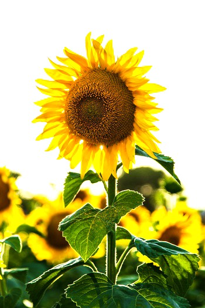

# imgx

[](https://pkg.go.dev/github.com/razzkumar/imgx)

Package imgx provides basic image processing functions (resize, rotate, crop, brightness/contrast adjustments, etc.).

All the image processing functions provided by the package accept any image type that implements `image.Image` interface
as an input, and return a new image of `*image.NRGBA` type (32bit RGBA colors, non-premultiplied alpha).

## Table of Contents

- [Installation](#installation)
  - [As a Library](#as-a-library)
  - [As a CLI Tool](#as-a-cli-tool)
- [Documentation](#documentation)
- [CLI Documentation](./CLI.md) - Complete CLI guide
- [Library Usage Examples](#library-usage-examples)
  - [Quick Start](#quick-start---using-as-a-library)
  - [Image Resizing](#image-resizing)
  - [Image Rotation](#image-rotation)
  - [Image Flipping](#image-flipping)
  - [Gaussian Blur](#gaussian-blur)
  - [Sharpening](#sharpening)
  - [Color Adjustments](#color-adjustments)
- [More Library Usage Examples](#more-library-usage-examples)
  - [Watermark Example](#example-3-add-watermark)
  - [Image Transformations](#example-4-image-transformations)
  - [Effects and Filters](#example-5-image-effects-and-filters)
- [Advanced Example: Image Collage](#advanced-example-image-collage)
- [Features](#features)
- [Performance](#performance)
- [FAQ](#faq)
- [Acknowledgments](#acknowledgments)
- [License](#license)

## Installation

### As a Library

```bash
go get -u github.com/razzkumar/imgx
```

### As a CLI Tool

```bash
# Build from source
go build -o imgx ./cmd/imgx

# Or install
go install github.com/razzkumar/imgx/cmd/imgx@latest
```

**Quick CLI Examples:**

```bash
# Resize an image
imgx resize photo.jpg -w 800 -o resized.jpg

# Create a thumbnail
imgx thumbnail photo.jpg -s 150 -o thumb.jpg

# Adjust colors
imgx adjust photo.jpg --brightness 10 --contrast 20 -o adjusted.jpg

# Apply blur effect
imgx blur photo.jpg --sigma 2.5 -o blurred.jpg
```

For complete CLI documentation with all commands, options, and examples, see **[CLI Documentation](./CLI.md)**.

## Documentation

**Library API:** https://pkg.go.dev/github.com/razzkumar/imgx
**CLI Tool:** [CLI.md](./CLI.md)

## Library Usage Examples

A few usage examples can be found below. See the documentation for the full list of supported functions.

### Quick Start - Using as a Library

```go
package main

import (
    "log"
    "github.com/razzkumar/imgx"
)

func main() {
    // Open an image file
    src, err := imgx.Open("input.jpg")
    if err != nil {
        log.Fatalf("failed to open image: %v", err)
    }

    // Resize to width 800px, maintaining aspect ratio
    dst := imgx.Resize(src, 800, 0, imgx.Lanczos)

    // Save the result
    err = imgx.Save(dst, "output.jpg")
    if err != nil {
        log.Fatalf("failed to save image: %v", err)
    }
}
```

### Image resizing

```go
// Resize srcImage to size = 128x128px using the Lanczos filter.
dstImage128 := imgx.Resize(srcImage, 128, 128, imgx.Lanczos)

// Resize srcImage to width = 800px preserving the aspect ratio.
dstImage800 := imgx.Resize(srcImage, 800, 0, imgx.Lanczos)

// Scale down srcImage to fit the 800x600px bounding box.
dstImageFit := imgx.Fit(srcImage, 800, 600, imgx.Lanczos)

// Resize and crop the srcImage to fill the 100x100px area.
dstImageFill := imgx.Fill(srcImage, 100, 100, imgx.Center, imgx.Lanczos)
```

**Example Output:**

**Original Image (1280×853):**


**After `Resize(src, 200, 0, imgx.Lanczos)` - Resized to width 200px, height auto:**


**After `Fill(src, 300, 300, imgx.Center, imgx.Lanczos)` - Square thumbnail 300×300:**


Imaging supports image resizing using various resampling filters. The most notable ones:
- `Lanczos` - A high-quality resampling filter for photographic images yielding sharp results.
- `CatmullRom` - A sharp cubic filter that is faster than Lanczos filter while providing similar results.
- `MitchellNetravali` - A cubic filter that produces smoother results with less ringing artifacts than CatmullRom.
- `Linear` - Bilinear resampling filter, produces smooth output. Faster than cubic filters.
- `Box` - Simple and fast averaging filter appropriate for downscaling. When upscaling it's similar to NearestNeighbor.
- `NearestNeighbor` - Fastest resampling filter, no antialiasing.

The full list of supported filters:  NearestNeighbor, Box, Linear, Hermite, MitchellNetravali, CatmullRom, BSpline, Gaussian, Lanczos, Hann, Hamming, Blackman, Bartlett, Welch, Cosine. Custom filters can be created using ResampleFilter struct.

**Resampling filters comparison**

The same image can be resized using different resampling filters.
From faster (lower quality) to slower (higher quality): `NearestNeighbor`, `Linear`, `CatmullRom`, `Lanczos`.

### Image Rotation

```go
// Rotate 90 degrees clockwise
rotated90 := imgx.Rotate90(srcImage)

// Rotate 180 degrees
rotated180 := imgx.Rotate180(srcImage)

// Rotate 270 degrees clockwise (90 counter-clockwise)
rotated270 := imgx.Rotate270(srcImage)

// Rotate arbitrary angle (45 degrees) with white background
rotated45 := imgx.Rotate(srcImage, 45, color.White)
```

**Example Output:**

**Original Image:**


**After `Rotate90(src)` - Rotated 90° clockwise:**


**After `Rotate(src, 45, color.White)` - Rotated 45° with white background:**


### Image Flipping

```go
// Flip horizontally
flippedH := imgx.FlipH(srcImage)

// Flip vertically
flippedV := imgx.FlipV(srcImage)
```

**Example Output:**

**Original Image:**


**After `FlipH(src)` - Flipped horizontally:**


### Gaussian Blur

```go
// Light blur
lightBlur := imgx.Blur(srcImage, 0.5)

// Medium blur
mediumBlur := imgx.Blur(srcImage, 2.0)

// Heavy blur
heavyBlur := imgx.Blur(srcImage, 5.0)
```

Sigma parameter allows to control the strength of the blurring effect. Higher values create stronger blur.

**Example Output:**

**Original Image:**


**After `Blur(src, 2.0)` - Gaussian blur with sigma=2.0:**


### Sharpening

```go
// Light sharpening
lightSharp := imgx.Sharpen(srcImage, 0.5)

// Medium sharpening
mediumSharp := imgx.Sharpen(srcImage, 1.0)

// Heavy sharpening
heavySharp := imgx.Sharpen(srcImage, 2.0)
```

`Sharpen` uses unsharp mask technique internally. Sigma parameter controls the strength of the sharpening effect.

**Example Output:**

**Original Image:**


**After `Sharpen(src, 1.5)` - Sharpened with sigma=1.5:**


### Color Adjustments

#### Gamma Correction

```go
// Darken image (gamma < 1.0)
darker := imgx.AdjustGamma(srcImage, 0.5)

// Lighten image (gamma > 1.0)
lighter := imgx.AdjustGamma(srcImage, 1.5)
```

#### Contrast Adjustment

```go
// Decrease contrast
lowContrast := imgx.AdjustContrast(srcImage, -20)

// Increase contrast
highContrast := imgx.AdjustContrast(srcImage, 20)
```

Range: -100 (min contrast) to 100 (max contrast)

**Example Output:**

**Original Image:**


**After `AdjustContrast(src, 30)` - Increased contrast:**



#### Brightness Adjustment

```go
// Decrease brightness
darker := imgx.AdjustBrightness(srcImage, -20)

// Increase brightness
brighter := imgx.AdjustBrightness(srcImage, 20)
```

Range: -100 (darkest) to 100 (brightest)

**Example Output:**

**Original Image:**


**After `AdjustBrightness(src, 30)` - Increased brightness:**


#### Saturation Adjustment

```go
// Desaturate (move towards grayscale)
desaturated := imgx.AdjustSaturation(srcImage, -50)

// Increase saturation (more vivid colors)
saturated := imgx.AdjustSaturation(srcImage, 50)

// Complete desaturation
grayscale := imgx.AdjustSaturation(srcImage, -100)
```

Range: -100 (grayscale) to 500 (highly saturated)

**Example Output:**

**Original Image:**


**After `AdjustSaturation(src, 50)` - Increased saturation:**


#### Hue Adjustment

```go
// Shift hue by 20 degrees
shifted := imgx.AdjustHue(srcImage, 20)

// Shift hue by 180 degrees (complementary colors)
inverted := imgx.AdjustHue(srcImage, 180)
```

Range: -180 to 180 degrees

#### Grayscale Conversion

```go
// Convert image to grayscale
gray := imgx.Grayscale(srcImage)
```

**Example Output:**

**Original Image:**


**After `Grayscale(src)` - Converted to grayscale:**


**Example:** Complete color adjustment pipeline
```go
src, _ := imgx.Open("input.jpg")

// Adjust multiple properties
result := src
result = imgx.AdjustBrightness(result, 10)
result = imgx.AdjustContrast(result, 20)
result = imgx.AdjustSaturation(result, 30)

imgx.Save(result, "output_adjusted.jpg")
```

## More Library Usage Examples

### Example 1: Create Thumbnail Gallery

```go
package main

import (
    "log"
    "github.com/razzkumar/imgx"
)

func main() {
    // Open source image
    src, err := imgx.Open("photo.jpg")
    if err != nil {
        log.Fatal(err)
    }

    // Create different thumbnail sizes
    thumb100 := imgx.Thumbnail(src, 100, 100, imgx.Lanczos)
    thumb200 := imgx.Thumbnail(src, 200, 200, imgx.Lanczos)
    thumb400 := imgx.Thumbnail(src, 400, 400, imgx.Lanczos)

    // Save thumbnails
    imgx.Save(thumb100, "thumb_100.jpg")
    imgx.Save(thumb200, "thumb_200.jpg")
    imgx.Save(thumb400, "thumb_400.jpg")
}
```

### Example 2: Batch Image Processing

```go
package main

import (
    "log"
    "os"
    "path/filepath"
    "strings"
    "github.com/razzkumar/imgx"
)

func main() {
    // Process all JPG files in a directory
    files, _ := filepath.Glob("input/*.jpg")

    for _, file := range files {
        // Open image
        src, err := imgx.Open(file)
        if err != nil {
            log.Printf("Failed to open %s: %v", file, err)
            continue
        }

        // Process: resize and enhance
        processed := imgx.Resize(src, 1920, 0, imgx.Lanczos)
        processed = imgx.AdjustContrast(processed, 10)
        processed = imgx.Sharpen(processed, 0.5)

        // Save with new name
        basename := filepath.Base(file)
        outname := "output/" + strings.TrimSuffix(basename, ".jpg") + "_processed.jpg"

        if err := imgx.Save(processed, outname); err != nil {
            log.Printf("Failed to save %s: %v", outname, err)
        }
    }
}
```

### Example 3: Add Watermark

```go
package main

import (
    "image"
    "log"
    "github.com/razzkumar/imgx"
)

func main() {
    // Open main image
    src, err := imgx.Open("photo.jpg")
    if err != nil {
        log.Fatal(err)
    }

    // Open watermark
    watermark, err := imgx.Open("watermark.png")
    if err != nil {
        log.Fatal(err)
    }

    // Resize watermark to 20% of image width
    bounds := src.Bounds()
    wmWidth := bounds.Dx() / 5
    watermark = imgx.Resize(watermark, wmWidth, 0, imgx.Lanczos)

    // Position watermark in bottom-right corner
    wmBounds := watermark.Bounds()
    position := image.Pt(
        bounds.Dx()-wmBounds.Dx()-20,
        bounds.Dy()-wmBounds.Dy()-20,
    )

    // Overlay watermark with transparency
    result := imgx.Overlay(src, watermark, position, 0.6)

    // Save result
    imgx.Save(result, "watermarked.jpg")
}
```

**Example Output:**

**Original Image:**


**After adding watermark with `Overlay()` - Watermark in bottom-right corner with 60% opacity:**


### Example 4: Image Transformations

```go
package main

import (
    "log"
    "github.com/razzkumar/imgx"
)

func main() {
    src, err := imgx.Open("photo.jpg")
    if err != nil {
        log.Fatal(err)
    }

    // Rotate 90 degrees
    rotated90 := imgx.Rotate90(src)
    imgx.Save(rotated90, "rotated_90.jpg")

    // Rotate 45 degrees with white background
    rotated45 := imgx.Rotate(src, 45, imgx.White)
    imgx.Save(rotated45, "rotated_45.jpg")

    // Flip horizontal
    flipped := imgx.FlipH(src)
    imgx.Save(flipped, "flipped_h.jpg")

    // Flip vertical
    flippedV := imgx.FlipV(src)
    imgx.Save(flippedV, "flipped_v.jpg")

    // Transpose (flip + rotate)
    transposed := imgx.Transpose(src)
    imgx.Save(transposed, "transposed.jpg")
}
```

### Example 5: Image Effects and Filters

```go
package main

import (
    "log"
    "github.com/razzkumar/imgx"
)

func main() {
    src, err := imgx.Open("photo.jpg")
    if err != nil {
        log.Fatal(err)
    }

    // Convert to grayscale
    gray := imgx.Grayscale(src)
    imgx.Save(gray, "grayscale.jpg")

    // Invert colors
    inverted := imgx.Invert(src)
    imgx.Save(inverted, "inverted.jpg")

    // Apply custom convolution (edge detection)
    edgeDetect := imgx.Convolve3x3(
        src,
        [9]float64{
            -1, -1, -1,
            -1,  8, -1,
            -1, -1, -1,
        },
        nil,
    )
    imgx.Save(edgeDetect, "edges.jpg")

    // Emboss effect
    emboss := imgx.Convolve3x3(
        src,
        [9]float64{
            -1, -1, 0,
            -1,  1, 1,
             0,  1, 1,
        },
        nil,
    )
    imgx.Save(emboss, "embossed.jpg")
}
```

### Example 6: Working with Different Image Formats

```go
package main

import (
    "log"
    "github.com/razzkumar/imgx"
)

func main() {
    // Open with auto-orientation from EXIF
    src, err := imgx.Open("photo.jpg", imgx.AutoOrientation(true))
    if err != nil {
        log.Fatal(err)
    }

    // Process
    processed := imgx.Resize(src, 800, 0, imgx.Lanczos)

    // Save as different formats
    imgx.Save(processed, "output.jpg")  // JPEG
    imgx.Save(processed, "output.png")  // PNG
    imgx.Save(processed, "output.gif")  // GIF
    imgx.Save(processed, "output.tiff") // TIFF
    imgx.Save(processed, "output.bmp")  // BMP
}
```

## FAQ

### Incorrect image orientation after processing (e.g. an image appears rotated after resizing)

Most probably, the given image contains the EXIF orientation tag.
The standard `image/*` packages do not support loading and saving
this kind of information. To fix the issue, try opening images with
the `AutoOrientation` decode option. If this option is set to `true`,
the image orientation is changed after decoding, according to the
orientation tag (if present). Here's the example:

```go
img, err := imgx.Open("test.jpg", imgx.AutoOrientation(true))
```

### What's the difference between `imaging` and `gift` packages?

[imaging](https://github.com/razzkumar/imgx)
is designed to be a lightweight and simple image manipulation package.
It provides basic image processing functions and a few helper functions
such as `Open` and `Save`. It consistently returns *image.NRGBA image 
type (8 bits per channel, RGBA).

## Advanced Example: Image Collage

This example demonstrates creating a 2x2 collage with different effects applied to each quadrant:

```go
package main

import (
	"image"
	"image/color"
	"log"

	"github.com/razzkumar/imgx"
)

func main() {
	// Open a test image.
	src, err := imgx.Open("testdata/flower.jpg")
	if err != nil {
		log.Fatalf("failed to open image: %v", err)
	}

	// Crop the original image to 300x300px size using the center anchor.
	src = imgx.CropAnchor(src, 300, 300, imgx.Center)

	// Resize the cropped image to width = 200px preserving the aspect ratio.
	src = imgx.Resize(src, 200, 0, imgx.Lanczos)

	// Create a blurred version of the image.
	img1 := imgx.Blur(src, 5)

	// Create a grayscale version of the image with higher contrast and sharpness.
	img2 := imgx.Grayscale(src)
	img2 = imgx.AdjustContrast(img2, 20)
	img2 = imgx.Sharpen(img2, 2)

	// Create an inverted version of the image.
	img3 := imgx.Invert(src)

	// Create an embossed version of the image using a convolution filter.
	img4 := imgx.Convolve3x3(
		src,
		[9]float64{
			-1, -1, 0,
			-1, 1, 1,
			0, 1, 1,
		},
		nil,
	)

	// Create a new 400x400px image and paste the four produced images into it.
	dst := imgx.New(400, 400, color.NRGBA{0, 0, 0, 0})
	dst = imgx.Paste(dst, img1, image.Pt(0, 0))      // Top-left: Blurred
	dst = imgx.Paste(dst, img2, image.Pt(0, 200))    // Bottom-left: Grayscale + Enhanced
	dst = imgx.Paste(dst, img3, image.Pt(200, 0))    // Top-right: Inverted
	dst = imgx.Paste(dst, img4, image.Pt(200, 200))  // Bottom-right: Embossed

	// Save the resulting image as JPEG.
	err = imgx.Save(dst, "testdata/out_example.jpg")
	if err != nil {
		log.Fatalf("failed to save image: %v", err)
	}

	log.Println("Collage created successfully: testdata/out_example.jpg")
}
```

**Output:** A 2x2 grid showing the same image with four different effects applied.

## Features

imgx provides a comprehensive set of image processing capabilities:

**Resizing & Transformations:**
- Multiple resampling filters (Lanczos, CatmullRom, Linear, Box, NearestNeighbor, etc.)
- Resize, Fit, Fill, Thumbnail operations
- Rotate (90°, 180°, 270°, arbitrary angles)
- Flip horizontal/vertical, Transpose, Transverse
- Crop with anchor points

**Color Adjustments:**
- Brightness, Contrast, Gamma correction
- Saturation, Hue adjustments
- Grayscale conversion
- Color inversion

**Effects & Filters:**
- Gaussian blur
- Unsharp mask sharpening
- Custom 3x3 and 5x5 convolution kernels
- Edge detection, emboss, and custom effects

**Image Composition:**
- Paste images together
- Overlay with alpha blending
- Watermarking support
- Create collages and thumbnails

**I/O & Format Support:**
- Formats: JPEG, PNG, GIF, TIFF, BMP
- EXIF auto-orientation for JPEG files
- Encode/Decode with custom options
- Format auto-detection from file extensions

**Performance:**
- Parallel processing across CPU cores
- Optimized scanners for common image formats
- Separable filter approach for resize and blur
- Memory-efficient streaming operations

## Performance

imgx is designed for high performance with parallel processing and optimized algorithms.

### Running Benchmarks

```bash
# Run all benchmarks
go test -bench=.

# Run specific benchmark with memory stats
go test -bench=BenchmarkResize -benchmem

# Run benchmarks multiple times for accuracy
go test -bench=. -benchtime=10s -count=3
```

### Example Benchmark Results

```
BenchmarkResize-8        100   12.3 ms/op   8.2 MB/s   4.5 MB/op
BenchmarkBlur-8          50    24.5 ms/op   4.1 MB/s   6.2 MB/op
BenchmarkRotate90-8      200   5.8 ms/op    17.2 MB/s  2.1 MB/op
BenchmarkGrayscale-8     300   4.2 ms/op    23.8 MB/s  1.8 MB/op
```

The library automatically utilizes all available CPU cores for operations on large images. You can control parallelism using:

```go
imgx.SetMaxProcs(4)  // Limit to 4 CPU cores
```

## Acknowledgments

This project is based on the [imaging](https://github.com/disintegration/imaging) library created by [Grigory Dryapak](https://github.com/disintegration).

### What's New in imgx?

imgx builds upon the original imaging library with several improvements:

- **Modernized codebase** using Go 1.21+ features:
  - Range over int (`for range 256`)
  - Built-in `min`/`max` functions
  - `WaitGroup.Go()` for goroutine management
  - `b.Loop()` for benchmarks
- **Improved code organization**: Refactored complex functions for better maintainability
- **CLI tool**: Full-featured command-line interface for batch processing
- **Active development**: Regular updates and new features
- **Better documentation**: Comprehensive examples and usage guides

We're grateful to the original author for creating such a solid foundation for image processing in Go!

## License

This project maintains the original license. Please see the LICENSE file for details.
